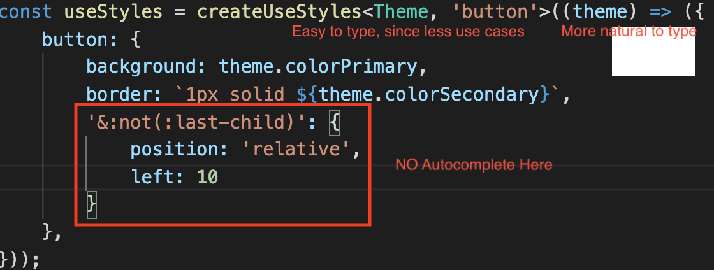
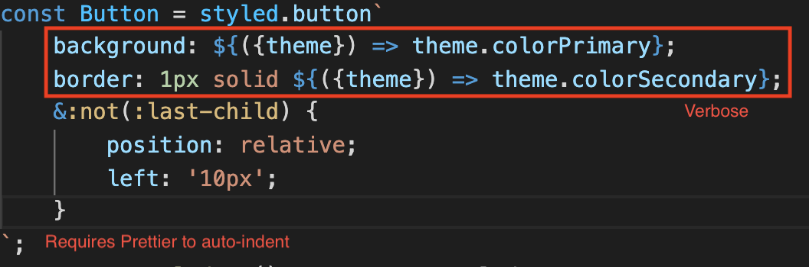

# Comparison of 2 CSS-in-JS styling options JSS vs Styled

1. Plain case
   Both are good. For lots of static properties styled-components is better. For lots of dynamic properties jss code-styled is more convenient. JSS was picked as a styling sollution to the most well-written front-end components library - Material UI.
   Styled-components is typing a lot of <b>`</b> character, while jss is typing a lot of <b>()</b>. JSS follows more conventional JS object/properties/callback model. Styled-components use string templating to assign a value to dynamic parts of a styles definition.
   Styled-components 10 times more popular then JSS. For MaterialUI project a JSS styling sollution is a better fit.
2. Using selectors
   Both libraries can defined selectors of any level of complexity and them both do this in a form of the plain string. Plain-string is styled-components primary format of styling and is better handled there.
3. Theming
   Both solutions support typings out of the box. Styled-components types are provided by the separate typings module, are more complex to understand then JSS typings. It was not trivial to type a themed styled-component-generated component. But it's possible to create a custom generic type, using the types provided by styled-components. It just requires a bit more time.
4. IDE support (autocomplete)
   IDE support is good in case of JSS for simple cases. But for styling elements with nested selectors it lacks autocomplete features.
   Visual Studio Code has a great vscode-styled-components extension that adds autocomplete features to all the styled-components usage cases.
5. Code-style
   The result of JSS styling is the custom hook, which will be placed at the start of the functional component and can not be added conditionaly since the amount of hooks can not be changed between renders.
   
   The result of Styled-components styling is a Component, that has less restrictions, but can not be styled using spreading operator trick `({...mixin1, ...mixin2})`. A new Component must be defined instead, extending all the mixins. Though mixins approach is offen misused, which makes the code brittle and more difficult to debug.
   

I'm biased towards the styled-components.
